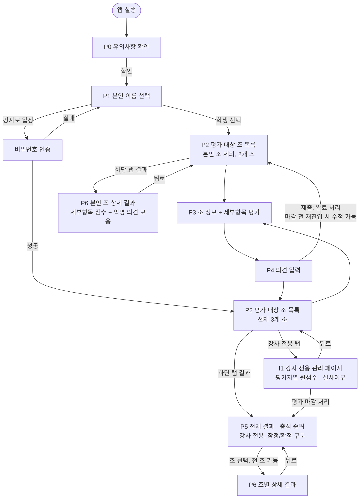

# 조별 프로젝트 평가 앱 — 페이지 구성안 및 내비게이션 맵

**근거 문서**: [`조별_프로젝트_평가기준.md`](./조별_프로젝트_평가기준.md), [`앱_설계기준`](./앱_설계기준)
**대상**: 수강생 15명(1조~3조, 각 5명) + 강사(이정현, 1인)
**플랫폼**: 모바일 웹/앱

---

## 1. 역할별 접근 범위 요약

| 역할 | 평가 대상 조 | 접근 가능 페이지 |
|---|---|---|
| 수강생 | 본인 소속 조를 **제외한** 나머지 2개 조 | P0~P4, P6(단 **본인 소속 조만**) — P5 전체 순위 목록은 접근 불가 |
| 강사(이정현) | **전체 3개 조** (소속 조 없음) | 공통 페이지 전체(P0~P6, P6은 전 조 열람 가능) + 강사 전용 페이지(I1), 접근 시 비밀번호 인증 필요 |

- 소속 조 판별과 자기 조 제외는 [`조별 명단.txt`](./조별 명단.txt) 기준으로 앱이 자동 처리합니다. ([평가기준 4장 — 상호평가 시 자기 조 채점 제외](./조별_프로젝트_평가기준.md#4-평가-시-유의사항) 반영)
- **결과 열람 범위**: 수강생은 다른 조의 최종 점수를 전혀 볼 수 없으며, 하단 탭 "결과"를 누르면 순위 목록 없이 **본인 소속 조의 상세 결과(P6)로 바로 이동**합니다. 전체 조 순위(P5)와 타 조 상세 결과 열람은 **강사 전용**입니다.
- 강사 점수는 [3-1 평가자 구성](./조별_프로젝트_평가기준.md#3-1-평가자-구성)에 따라 3배 가중치로 별도 집계됩니다. 강사는 이정현 1인으로 한정되어 다수 강사 간 가중치 배분 이슈는 없습니다.

---

## 2. 전체 페이지 목록

| ID | 페이지명 | 접근 권한 | 주요 내용 | 연관 평가기준 |
|---|---|---|---|---|
| P0 | 유의사항 확인 | 전체 | 앱 최초 진입 시 표시. 근거 없는 점수 금지, 완성도/확장계획/AI협업 분리 채점 원칙 등을 요약 고지. "확인했습니다" 동의 후 진행 | [4장 평가 시 유의사항](./조별_프로젝트_평가기준.md#4-평가-시-유의사항) |
| P1 | 평가자 본인 확인 | 전체 | 본인 이름을 목록에서 선택(학생 15명) 또는 "강사(이정현)로 입장" 선택. 강사 선택 시 **비밀번호 입력 인증** 절차 진행. 선택 결과로 소속 조·역할을 내부적으로 확정 | [3-1 평가자 구성](./조별_프로젝트_평가기준.md#3-1-평가자-구성) |
| P2 | 평가 대상 조 목록(탭) | 전체 | 평가 가능한 조를 탭/카드로 나열. 조별 진행 배지 표시(마감 전: "제출완료·수정가능"/"미완료", 마감 후: "제출완료·수정불가"/"미제출"). 학생은 본인 조가 목록에서 자동 제외 | [4장 — 자기 조 채점 제외](./조별_프로젝트_평가기준.md#4-평가-시-유의사항) |
| P3 | 조 정보 및 세부항목 평가 | 전체 | 조 기본정보(조이름·조장·조원·프로젝트 주제) + 자기신고 정보(완료범위·향후계획·AI협업범위) + 13개 세부항목 점수 **선택형** 입력 | [2장 평가 항목](./조별_프로젝트_평가기준.md#2-평가-항목-및-세부-기준-총-100점), [5-1 발표 필수 고지 항목](./조별_프로젝트_평가기준.md#5-1-발표-필수-고지-항목-조별-자기신고) |
| P4 | 의견 입력 | 전체 | 해당 조에 대한 자유 의견/감상 텍스트 입력 후 제출 → 해당 조 평가 완료 처리, P2로 복귀. **마감 전까지는 P2에서 재진입해 점수·의견 수정 가능** | [앱_설계기준 4항] |
| P5 | 전체 결과(순위) | **강사 전용** | 모든 조의 **최종 총점만** 리스트/순위로 표시(세부내역 비공개). 마감 전에는 **잠정 결과**, 마감 처리 후에는 **확정 결과**로 구분 표시. 항목 탭하면 P6로 이동. 수강생은 이 페이지 자체에 접근하지 않음(하단 "결과" 탭이 바로 P6으로 연결됨) | [3-2 최종 점수 산출 방법](./조별_프로젝트_평가기준.md#3-2-최종-점수-산출-방법-절사-가중평균) |
| P6 | 조별 상세 결과 | 전체(**수강생은 본인 소속 조만**, 강사는 전 조) | 선택한 조의 **세부항목별 최종 점수**(13개, 절사·가중평균 반영, 잠정/확정 구분)와 **평가자 전원의 익명 의견 목록**을 열람 (개인별 원점수는 비공개). 수강생이 본인 조가 아닌 groupId로 직접 접근을 시도해도 서버에서 차단되어 결과 화면으로 되돌아감 | [3-2 최종 점수 산출 방법](./조별_프로젝트_평가기준.md#3-2-최종-점수-산출-방법-절사-가중평균) |
| I1 | 강사 전용 관리 페이지 | 강사(이정현)만, 비밀번호 인증 필요 | 조별 × 평가자별 원점수 매트릭스, 절사(최고2·최저2) 대상 여부 표시, **평가 마감 처리** 기능 (강사 본인의 채점 입력은 P3/P4에서 학생과 동일하게 진행) | [3-2 최종 점수 산출 방법](./조별_프로젝트_평가기준.md#3-2-최종-점수-산출-방법-절사-가중평균) |

---

## 3. 내비게이션 맵

**흐름 설명**

1. **P0→P1**: 최초 진입 시 1회(또는 세션마다) 유의사항 동의 → 본인 확인.
2. **P1 분기**: 학생은 바로 P2로, 강사(이정현)는 **비밀번호 인증**을 통과해야 P2(전체 3개 조)로 진입. 인증 실패 시 P1로 복귀.
3. **P3↔P4 루프**: 조 하나를 평가(P3: 점수 선택 → P4: 의견 입력 → 제출)할 때마다 P2로 돌아가 다음 조를 선택하는 구조. **마감 전까지는** 이미 제출한 조도 P2에서 다시 선택해 P3/P4를 재진입, 점수·의견을 수정할 수 있음.
4. **결과 열람(P5/P6)**: 역할에 따라 경로가 다릅니다. **학생**은 하단 "결과" 탭을 누르면 순위 목록 없이 **본인 소속 조의 P6으로 바로 이동**하며, 다른 조의 점수는 어떤 화면에서도 노출되지 않습니다. **강사**는 P5(전체 순위)에 먼저 진입해 원하는 조를 선택해 P6으로 이동하며, 모든 조를 열람할 수 있습니다. 마감 전에는 **잠정 결과**(조회 시점 기준 계산값), 강사가 I1에서 마감 처리를 실행하면 **확정 결과**로 전환.
5. **I1**: 강사(이정현)만 비밀번호 인증 후 접근하는 별도 탭. 평가자 익명성이 유지되는 P6과 달리, I1은 개인별 원점수·절사여부까지 실명으로 노출되는 관리자 화면이며, 여기서 "평가 마감 처리"를 실행하면 전체 결과가 확정되어 P5/P6에 반영됨.

---

## 4. 화면별 핵심 구성 요소

### P0. 유의사항 확인
- 평가 원칙 요약 카드(3~4개): 근거 기반 채점 / 완성도-확장계획 분리 / AI 협업은 비율이 아닌 과정 품질 / 자기 조 채점 제외
- "확인했습니다" 버튼 (미확인 시 다음 단계 진행 불가)

### P1. 본인 이름 선택
- 학생 15명 리스트(조별 그룹핑 표시: 1조/2조/3조) — 단일 선택
- 하단 "강사(이정현)로 입장" 버튼 → 탭 시 **비밀번호 입력 모달** 노출, 인증 성공 시에만 P2(전체 3개 조)로 진입

### P2. 평가 대상 조 목록(탭)
- 조 카드: 조 이름 · 진행 배지
  - 마감 전: ✅ 제출완료·수정가능 / ⏳ 미완료
  - 마감 후: 🔒 제출완료·수정불가 / ⚠️ 미제출
- 학생: 2개 조 카드만 노출 / 강사: 3개 조 카드 노출
- 하단 탭바: [평가하기] [결과] (+ 강사만 [관리]). **"결과" 탭은 역할에 따라 목적지가 다름**(학생: 본인 조 P6 직행 / 강사: 전체 순위 P5)

### P3. 조 정보 및 세부항목 평가
- 상단: 조 이름·조장·조원·프로젝트 주제
- **자기신고 섹션** (5-1): 완료·검증된 범위 / 향후 개발 계획(해당없음 가능) / AI 협업 범위·직접구현 근거 — 스코어 입력 전 필수 열람
- 항목별 세부점수 입력 UI: **선택형 6단계 버튼** (예: 매우부족·부족·보통·양호·우수·매우우수 = 배점의 0/20/40/60/80/100%), 텍스트 입력 없음
  - ① 문제 정의 및 기획력 (3개 세부항목)
  - ② 바이브 코딩(AI 협업) 과정 (3개) — 채점 시 자기신고의 AI 협업 범위 참고
  - ③ 결과물의 완성도 및 작동성 (3개) — 채점 시 자기신고의 완료범위만 참고(향후계획 제외)
  - ④ 실용성 및 활용 가치 (2개) — 향후 확장·응용 가능성은 향후계획 참고
  - ⑤ 발표 및 시연 설득력 (2개)
- 하단: 현재까지 선택된 합계 실시간 표시 → "다음(의견 입력)" 버튼
- **자동 임시저장**: 항목을 선택할 때마다 즉시 서버에 임시 저장되어, 앱을 이탈했다가 다시 들어와도 선택값이 유지됨(P4에서 "제출"하기 전까지는 P2 배지가 "미완료"로 유지)

### P4. 의견 입력
- 자유 텍스트 입력란(감상/의견, **선택 사항** — 비워둔 채로도 제출 가능)
- "제출" 버튼 → 제출 즉시 P2로 복귀. **제출 후에도 마감 전까지는 P2에서 해당 조를 다시 선택해 P3/P4를 재진입, 점수·의견을 수정하고 재제출 가능**(기존 입력값이 폼에 채워진 채로 열림)

### P5. 전체 결과 (강사 전용)
- **강사만 접근**. 학생이 하단 "결과" 탭을 누르면 이 화면을 거치지 않고 곧바로 P6(본인 조)으로 이동하므로, 학생은 이 화면 자체를 볼 수 없음
- 조별 카드: 조 이름 + 최종 총점만 표시(세부 비공개), 총점 기준 정렬
- 상단에 상태 배지: **"잠정 결과"**(마감 전, 조회 시점 기준 계산값이라 변동 가능) / **"확정 결과"**(강사 마감 처리 후, 더 이상 변동 없음)
- 제출 현황 안내(예: "3조 평가 진행률 8/11명 완료" — 타 조 수강생 10명 + 강사 1명 기준)

### P6. 조별 상세 결과
- **접근 범위**: 학생은 본인 소속 조만 열람 가능(다른 조의 groupId로 직접 접근을 시도해도 서버에서 차단되어 자신의 결과 화면으로 되돌아감). 강사는 P5에서 조를 선택해 전 조를 열람 가능
- 세부항목 13개 × 최종 점수(절사·가중평균 반영) 표 — [5-2 세부항목 채점표](./조별_프로젝트_평가기준.md#5-2-세부항목-채점표) 구조 재사용, P5와 동일하게 잠정/확정 상태 배지 표시
- 해당 조에 제출된 전체 의견 목록 — **작성자는 익명**(예: "평가자 A", "평가자 B" 등 조 내 순번 라벨)으로 표시. 라벨은 **해당 조에 대한 최초 제출 시각 순으로 1회 고정 배정**되며, 이후 마감 전 재수정·재제출을 하더라도 라벨은 바뀌지 않음
- 하단 탭바 포함(학생에게는 이 화면이 "결과" 탭의 최종 목적지). 뒤로가기는 학생은 P2(평가 대상 조 목록)로, 강사는 P5(전체 순위)로 이동

### I1. 강사 전용 관리 페이지
- **비밀번호 인증 통과 후 접근** (강사 이정현 전용)
- **강사 본인의 채점은 이 페이지에서 하지 않음** — 강사도 P2(전체 3개 조)→P3→P4의 동일한 흐름으로 채점하며, 제출 시 role=instructor로 저장되어 최종 계산 단계(F7)에서 자동으로 ×3 가중치가 적용됨. I1은 순수 조회·관리 전용 화면
- 조 선택 → 평가자별 원점수 매트릭스(13개 세부항목 또는 총점 기준), 각 행에 실명 표시(P6과 달리 익명 처리 안 함)
- 각 행에 **절사 대상 여부**(총점 기준 최고점 2인/최저점 2인 여부) 배지 표시. 절사 경계 동점 시 평가자 ID 오름차순 보조 기준 적용 사실도 함께 표시
- [3-2 산출식](./조별_프로젝트_평가기준.md#3-2-최종-점수-산출-방법-절사-가중평균)에 따른 계산 과정(절사 → 합산 → 강사가중 → 평균) 단계별 확인 뷰
- **"평가 마감 처리" 버튼**: 실행 시 전체 조 평가를 잠그고(더 이상 수정 불가) 절사·가중평균을 1회 확정 계산하여 P5/P6 상태를 "확정 결과"로 전환

---

## 5. 확정된 운영 정책

| 항목 | 결정 사항 |
|---|---|
| 강사 인증 방식 | P1에서 강사(이정현) 선택 시 **비밀번호 입력**으로 인증. 인증 성공 시에만 강사 전용 화면(P2 전체 3개 조, I1) 접근 가능 |
| 제출 후 수정 허용 여부 | **마감 전까지 수정 가능**. 제출해도 잠기지 않으며, P2에서 해당 조를 재선택해 P3/P4를 다시 열어 수정·재제출할 수 있음. 강사가 I1에서 "평가 마감 처리"를 실행한 시점에만 전체 잠금 |
| P6 의견 목록 작성자 표시 | **익명 처리**. "평가자 A/B/C" 등 조 내 순번 라벨로 표시하며 실명은 노출하지 않음 (단, 강사 전용 I1 화면에서는 실명 노출) |
| 강사 다수 시 가중치 처리 | 해당 없음 — **강사는 이정현 1인으로 한정**. 다수 강사 간 가중치 배분 로직은 필요하지 않음 |
| 평가 참여 완결성 | 모든 수강생·강사가 마감 전 채점을 완료하는 것이 운영 원칙. 단, 마감 전 잠정 결과는 `submitted=true`인 평가만 반영하며, 수강생 제출자가 5인 미만이면 절사를 생략함. 강사 미제출 시에는 점수를 계산하지 않고 **"강사 평가 대기 중"**으로 표시. 마감 처리는 13개 항목을 모두 제출한 대상자가 11명(타 조 수강생 10명 + 강사 1명)인지 확인한 뒤 실행 가능 |
| 강사 채점 경로 | **P3/P4로 통일**. 강사도 학생과 동일하게 P2(전체 3개 조)→P3→P4 흐름으로 채점하며, I1은 조회·관리(매트릭스, 절사여부, 마감처리) 전용 화면으로 한정 |
| P4 의견 입력 필수 여부 | **선택 사항**. 비워둔 채로도 제출 가능 |
| 결과 열람 범위 | **학생은 다른 조의 점수를 전혀 볼 수 없음**. 전체 순위(P5)는 강사 전용이며, 학생의 "결과" 탭은 본인 소속 조의 상세 결과(P6)로 직행함. 학생이 타 조 groupId로 P6에 직접 접근을 시도해도 서버 단에서 차단되어 본인 결과로 리다이렉트됨. 강사는 P5/P6 모두 전 조 열람 가능(I1에는 의견이 없어 P6이 강사가 의견을 확인하는 유일한 경로) |

> "마감 전까지 수정 가능"으로 정해짐에 따라, 결과 화면(P5/P6)은 마감 전 **잠정 결과**와 마감 후 **확정 결과**를 구분해 표시합니다. 계산 로직의 상세 흐름은 [`앱_기능맵.md` 3장](./앱_기능맵.md#3-점수-산출-엔진-흐름-핵심-로직)을 참고하세요.
