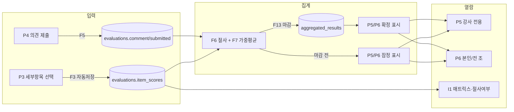

# 조별 프로젝트 평가 앱 — 화면설계서

**근거 문서**: [디자인 시안(`design/mockup.html`)](./design/mockup.html), [`앱_기능맵.md`](./앱_기능맵.md), [`앱_페이지구성_내비게이션맵.md`](./앱_페이지구성_내비게이션맵.md)
**목적**: 디자인 시안의 비주얼 규칙과 기능맵·내비게이션맵의 로직·흐름을 기준으로, 실제 구현된 각 화면의 레이아웃·구성요소·상태·인터랙션을 화면 단위로 상세 정의한다.
**대상 화면**: P0~P6, I1 (총 8개 라우트)

---

## 0. 공통 디자인 시스템

디자인 시안(`design/mockup.html`)에서 확정한 규칙을 전 화면에 공통 적용한다.

| 항목 | 값 |
|---|---|
| 폰트 | Pretendard (CDN) → 실패 시 system-ui 폴백 |
| 브랜드 컬러 | 블루 `#2563EB` (Tailwind `blue-600`) — 주요 액션 버튼, 선택된 상태, 강조 텍스트 |
| 배경 | 슬레이트 `slate-50`(`#F8FAFC`) 전체 배경, 카드/헤더/푸터는 `bg-white` |
| 테두리 | `border-slate-100`(헤더·푸터 구분선), `border-slate-200`(카드 테두리) |
| 텍스트 | 본문 `slate-900`(제목) / `slate-700`(본문) / `slate-500`(보조) / `slate-400`(캡션) |
| 레이아웃 폭 | 모바일 전용, `max-w-md`(28rem) 중앙 정렬 |
| 화면 3단 구조 | 상단 고정 헤더(`pt-10 px-5 pb-3 bg-white border-b`) + 스크롤 본문(`flex-1 overflow-y-auto`) + 하단 고정 바(`bg-white border-t`) |

### 공통 상태 배지 컬러

| 상태 | 배경/텍스트 클래스 | 사용 화면 |
|---|---|---|
| 잠정 결과 | `bg-amber-100 text-amber-700` (헤더 배지) / `bg-amber-50 text-amber-700` (소형 배지) | P5, P6, I1 |
| 확정 결과 | `bg-emerald-100 text-emerald-700` / `bg-emerald-50 text-emerald-700` | P5, P6, I1 |
| 제출완료·수정가능 | `bg-emerald-50 text-emerald-700` | P2 |
| 미완료 | `bg-amber-50 text-amber-700` | P2 |
| 제출완료·수정불가(마감 후) | `bg-slate-100 text-slate-500` | P2 |
| 미제출(마감 후) | `bg-red-50 text-red-600` | P2 |
| 에러 메시지 | `bg-red-50 text-red-600` | P1, P4, I1 |

### 공통 컴포넌트

- **하단 탭바**(P2, P5, P6): `평가하기`(📋) · `결과`(🏆) · `관리`(🛠️, 강사만) — 현재 화면은 파란색(`text-blue-600`)으로 강조, 나머지는 `text-slate-400`
- **상단 헤더 3분할**(P3~P6, I1): 좌측 뒤로가기(`←`, `text-slate-400`) / 중앙 화면 제목 / 우측 여백(``)으로 제목을 시각적 중앙 정렬
- **6단계 세그먼트 버튼**(P3): 항목당 6개 버튼, 선택 시 `border-blue-600 bg-blue-600 text-white`, 미선택 시 `border-slate-200 text-slate-400 bg-white`

---

## 1. 화면 목록 요약

| ID | 화면명 | 라우트 | 접근 권한 | 레이아웃 유형 | 관련 기능ID |
|---|---|---|---|---|---|
| P0 | 유의사항 확인 | `/` | 전체(비로그인 포함) | 헤더 + 카드 리스트 + CTA 버튼 | — |
| P1 | 본인 확인 | `/login` | 전체 | 헤더 + 조별 그룹 선택 리스트 + 강사 로그인 폼 | F1 |
| P2 | 평가 대상 조 목록 | `/groups` | 로그인 필요 | 헤더(사용자명·로그아웃) + 카드 리스트 + 하단 탭바 | F2, F12 |
| P3 | 조 정보 및 채점 | `/groups/[groupId]/score` | 로그인 + 본인 조 아님(F2) | 헤더 + 조정보카드 + 5개 항목군 카드 + 하단 합계바 | F3, F4 |
| P4 | 의견 입력 | `/groups/[groupId]/comment` | 로그인 + 본인 조 아님 | 헤더 + 의견 입력 폼 | F5 |
| P5 | 전체 결과 | `/results` | **강사 전용**(F2b) | 헤더(상태배지) + 순위 카드 리스트 + 하단 탭바 | F6, F7, F8, F2b |
| P6 | 조별 상세 결과 | `/results/[groupId]` | 로그인(**학생은 본인 조만**, F2b) | 헤더 + 총점카드 + 세부점수카드 + 의견카드 + 하단 탭바 | F6, F7, F9, F2b |
| I1 | 강사 전용 관리 | `/admin` | **강사 전용** | 헤더(상태배지) + 조별 매트릭스 카드 리스트 + 하단 액션바 | F6, F7, F10, F13 |

---

## 2. 화면별 상세 설계

### P0. 유의사항 확인 (`/`)

**접근 권한**: 전체(세션 없이도 접근 가능, 정적 화면)
**진입**: 앱 최초 접속
**이탈**: "확인했습니다" 클릭 → P1(`/login`)

| 영역 | 요소 | 타입 | 내용/텍스트 | 비고 |
|---|---|---|---|---|
| 상단 | 브랜드 라벨 | 텍스트 | "조별 프로젝트 평가" | `text-blue-600`, 12px |
| 상단 | 타이틀 | 텍스트(h1) | "평가 시 유의사항" | 20px bold |
| 상단 | 부제 | 텍스트 | "시작 전 아래 원칙을 확인해주세요." | `text-slate-500` |
| 본문 | 원칙 카드 ×4 | 카드 리스트(정적) | ① 근거 기반 채점 ② 완성도 ↔ 확장계획 분리 ③ AI 협업은 비율이 아닌 과정 품질 ④ 자기 조 채점 제외 | 하드코딩 배열(`PRINCIPLES`), 각 카드는 제목(bold)+설명(caption) 구조 |
| 하단 | CTA 버튼 | 버튼(Link) | "확인했습니다" | `bg-blue-600`, 클릭 시 `/login`으로 이동. 별도 동의 상태 저장 없음(MVP 범위 — 재방문 시에도 항상 노출) |

**예외 상태**: 없음(정적 페이지, 데이터 조회 없음)

---

### P1. 본인 확인 (`/login`)

**접근 권한**: 전체
**진입**: P0에서 "확인했습니다" 클릭, 또는 로그아웃 후 리다이렉트
**이탈**: 이름 선택(학생) 또는 강사 인증 성공 → P2(`/groups`)

| 영역 | 요소 | 타입 | 내용/텍스트 | 비고 |
|---|---|---|---|---|
| 상단 | 브랜드 라벨 | 텍스트 | "조별 프로젝트 평가" | `text-slate-400` |
| 상단 | 타이틀 | 텍스트(h2) | "본인 이름을 선택해주세요" | |
| 상단 | 에러 메시지 | 텍스트(조건부) | `?error=` 쿼리 파라미터 값 | 명단 불일치·비밀번호 불일치 시 표시 |
| 본문 | 조별 그룹 헤더 ×3 | 텍스트 | "{N}조 · {조이름}" | `getGroups()` 실데이터 |
| 본문 | 학생 이름 버튼 | 버튼(form submit) 2열 그리드 | 조원 이름(예: 나은수, 진대현 …) | 클릭 즉시 `loginAsStudentAction` 실행(선택 후 확인 단계 없이 바로 로그인) |
| 본문 | 구분선 | 텍스트 | "또는" | 좌우 `h-px bg-slate-200` 라인 |
| 본문 | 강사 라벨 | 텍스트 | "강사(이정현)로 입장" | |
| 본문 | 비밀번호 입력란 | `input[type=password]` | placeholder "비밀번호 입력" | `?instructor=1`일 때 자동 포커스 |
| 본문 | 강사 로그인 버튼 | 버튼(form submit) | "🔒 강사로 입장" | `loginAsInstructorAction` 실행 |

**예외 상태**
- 명단에 없는 이름 제출 → `?error=명단에서 이름을 찾을 수 없습니다.`로 리다이렉트
- 비밀번호 불일치 → `?error=비밀번호가 일치하지 않습니다.&instructor=1`

---

### P2. 평가 대상 조 목록 (`/groups`)

**접근 권한**: 로그인 필요(F1)
**진입**: P1 로그인 성공, P4 제출 완료, 하단 탭 "평가하기"
**이탈**: 조 카드 선택 → P3 / 하단 탭 "결과" → 학생은 P6(본인 조) 직행, 강사는 P5 / 하단 탭 "관리"(강사만) → I1 / "나가기" → 세션 종료 후 P1

| 영역 | 요소 | 타입 | 내용/텍스트 | 비고 |
|---|---|---|---|---|
| 상단 | 사용자 정보 | 텍스트 | "{강사 또는 수강생} · {이름}님" | |
| 상단 | 타이틀 | 텍스트(h2) | "평가 대상 조" | |
| 상단 | 로그아웃 버튼 | 버튼(밑줄 텍스트) | "나가기" | `logoutAction` → 세션 삭제 후 P1 |
| 본문 | 조 카드 리스트 | 카드 리스트(Link) | "{N}조 · {조이름}" + 상태배지 + 주제 텍스트 | 학생은 본인 조 제외(F2), 강사는 전체 3개 조 |
| 본문 | 상태 배지 | 배지 | ✅제출완료·수정가능 / ⏳미완료 / 🔒제출완료·수정불가 / ⚠️미제출 | 마감 여부 × 본인 제출 여부 조합(4가지) |
| 하단 | 탭바 | 탭바 | 평가하기(활성, 파란색) / 결과 / 관리(강사만) | |

**예외 상태**: 마감 후 미제출 카드는 `href="#"`로 비활성화(클릭해도 이동 없음)

---

### P3. 조 정보 및 세부항목 평가 (`/groups/[groupId]/score`)

**접근 권한**: 로그인 + 해당 groupId가 본인 소속 조가 아님(F2 서버 가드)
**진입**: P2 카드 선택
**이탈**: 상단 "←" → P2 / 하단 "다음(의견 입력)" → P4

| 영역 | 요소 | 타입 | 내용/텍스트 | 비고 |
|---|---|---|---|---|
| 상단 | 뒤로가기 | 아이콘 버튼 | "←" | → `/groups` |
| 상단 | 화면 제목 | 텍스트 | "{조이름}" (마감 후 "{조이름} (확정)" 접미) | |
| 본문 | 조 정보 카드 | 카드 | "조장 · {이름} / 조원 · {목록}" + 프로젝트 주제 | |
| 본문 | 자기신고 섹션 | 카드 내 텍스트 3줄 | 완료범위(초록) / 향후계획(황토) / AI협업범위(파랑) 라벨 + 내용 | F4, `조별_프로젝트_평가기준.md` 5-1 |
| 본문 | 에러 메시지 | 텍스트(조건부) | 저장 실패 시 메시지 | F3 저장 실패(마감 등) |
| 본문 | 항목군 카드 ×5 | 카드 | "① 문제 정의 및 기획력" 등 항목군 라벨 + 세부항목별 6단계 버튼 | ①(3개)·②(3개)·③(3개)·④(2개)·⑤(2개) = 13개 |
| 본문 | 세부항목 행 | 텍스트+버튼그룹 | 항목명 + 배점 (+ 저장 중 표시) + 6단계 버튼(0~5레벨의 실제 점수 표시) | 선택 즉시 `saveItemLevelAction` 호출(자동 임시저장, F3) |
| 하단 | 합계 표시 | 텍스트 | "현재까지 합계 ({응답수}/13)" + "{총점} / 100" | 클라이언트 상태로 실시간 계산 |
| 하단 | 다음 버튼 | 버튼(Link) | "다음(의견 입력)" (마감 후 "마감됨"으로 비활성) | → `/groups/[groupId]/comment` |

**예외 상태**
- 마감 후 접근: 본인이 이미 제출한 조만 조회 전용(readOnly)으로 열람 가능, 미제출 조는 P2로 리다이렉트
- 저장 실패(마감 중 시도 등): 상단에 에러 메시지 노출, 선택은 유지되나 서버 저장은 실패 상태

---

### P4. 의견 입력 (`/groups/[groupId]/comment`)

**접근 권한**: 로그인 + 본인 조 아님 + 마감 전
**진입**: P3 "다음(의견 입력)" 클릭
**이탈**: 제출 → P2 / 상단 "←" → P3

| 영역 | 요소 | 타입 | 내용/텍스트 | 비고 |
|---|---|---|---|---|
| 상단 | 뒤로가기 | 아이콘 버튼 | "←" | → `/groups/[groupId]/score` |
| 상단 | 화면 제목 | 텍스트 | "{조이름} · 의견 입력" | |
| 본문 | 에러/경고 메시지 | 텍스트(조건부) | 제출 실패 사유 또는 "아직 선택하지 않은 세부항목이 {N}개 있습니다. 이전 화면에서 모두 선택해주세요." | F5 검증 실패 시 |
| 본문 | 의견 입력란 | `textarea`(8행) | placeholder "이 조의 발표에 대한 감상이나 의견을 자유롭게 남겨주세요. 비워둔 채로도 제출할 수 있습니다." | 기존 값 있으면 `defaultValue`로 복원 |
| 본문 | 제출 버튼 | 버튼(form submit) | "제출" (이미 제출한 적 있으면 "재제출") | `submitEvaluationAction` |

**예외 상태**: 13개 항목 미완료 상태로 제출 시도 → F5가 차단, 동일 화면에 경고 문구와 함께 재표시(미선택 항목 위치까지는 이동하지 않음 — MVP 컷 범위)

---

### P5. 전체 결과 (`/results`) — 강사 전용

**접근 권한**: 로그인. **학생이 접근하면 F2b가 즉시 본인 조 P6으로 리다이렉트**하므로 이 화면은 실질적으로 강사만 도달
**진입**: 하단 탭 "결과"(강사)
**이탈**: 조 카드 선택 → P6 / 하단 탭 이동

| 영역 | 요소 | 타입 | 내용/텍스트 | 비고 |
|---|---|---|---|---|
| 상단 | 타이틀 | 텍스트(h2) | "전체 결과" | |
| 상단 | 상태 배지 | 배지 | "잠정 결과" / "확정 결과" | |
| 상단 | 부가 설명 | 텍스트 | "조회 시점 기준 계산값 · 마감 후 확정" / "마감 처리 완료 · 더 이상 변동 없음" | |
| 본문 | 순위 카드 리스트 | 카드 리스트(Link) | 순위 번호(원형 배지) + 조이름 + 진행률("{N}/{M}명 완료") + 총점 | 1위는 `border-2 border-blue-600 bg-blue-50` 강조. 총점 미확정(강사 미제출)이면 순위 "-", "강사 평가 대기 중" 표시(`formatScore`) |
| 본문 | 안내 문구 | 텍스트 | "조를 선택하면 세부항목 점수와 익명 의견을 볼 수 있어요 →" | |
| 하단 | 탭바 | 탭바 | 평가하기 / 결과(활성) / 관리 | |

**예외 상태**: 강사 미제출 조는 목록 하단(순위 없음)으로 정렬되어 노출

---

### P6. 조별 상세 결과 (`/results/[groupId]`)

**접근 권한**: 로그인. **학생은 본인 소속 조(session.groupId)와 groupId가 일치할 때만 접근 가능**, 불일치 시 F2b가 `/results`로 리다이렉트(→ 다시 본인 조로 재귀결). 강사는 전 조 접근 가능
**진입**: 학생 — 하단 탭 "결과"(직행) / 강사 — P5에서 조 카드 선택
**이탈**: 상단 "←" → 학생은 P2(`/groups`), 강사는 P5(`/results`) / 하단 탭 이동

| 영역 | 요소 | 타입 | 내용/텍스트 | 비고 |
|---|---|---|---|---|
| 상단 | 뒤로가기 | 아이콘 버튼 | "←" | 목적지는 역할에 따라 분기(`backHref`) |
| 상단 | 화면 제목 | 텍스트 | "{조이름}" | |
| 본문 | 총점 카드 | 카드 | 상태배지(잠정/확정) + 프로젝트 주제 + 총점(대형 숫자) | |
| 본문 | 세부점수 카드 | 카드 | "세부항목별 최종 점수" 타이틀 + 항목군 ①~⑤별 13개 항목 점수/배점 목록 | 강사 미제출 시 "강사 평가 대기 중" 문구만 표시 |
| 본문 | 의견 카드 | 카드 | "평가자 의견 ({N}건, 익명)" 타이틀 + 의견 리스트 | 각 의견은 "평가자 {anonLabel}" 라벨 + 본문(공백 시 "(의견 없음)") |
| 하단 | 탭바 | 탭바 | 평가하기 / 결과(활성) / 관리(강사만) | 학생에게는 이 화면이 "결과" 탭의 최종 목적지 |

**예외 상태**
- 제출된 의견이 없는 경우: "아직 제출된 의견이 없습니다."
- 강사 미제출: 총점·세부점수 모두 "강사 평가 대기 중"(의견 카드는 제출된 의견이 있으면 정상 표시)

---

### I1. 강사 전용 관리 (`/admin`)

**접근 권한**: 강사(role=instructor)만. 학생 접근 시 `/groups`로 리다이렉트
**진입**: P2 하단 탭 "관리"
**이탈**: 상단 "←" → P2 / "평가 마감 처리" 실행 → 동일 화면 새로고침(확정 상태로 전환)

| 영역 | 요소 | 타입 | 내용/텍스트 | 비고 |
|---|---|---|---|---|
| 상단 | 뒤로가기 | 아이콘 버튼 | "←" | → `/groups` |
| 상단 | 화면 제목 | 텍스트 | "강사 전용 관리" | |
| 상단 | 상태 배지 | 배지 | "잠정" / "확정" | |
| 본문 | 마감 실패 메시지 | 텍스트(조건부) | "완결성 검증에 실패한 조가 있어 마감을 취소했습니다. 아래 명단을 확인해주세요." | `?closeError=` |
| 본문 | 조별 매트릭스 카드 ×3 | 카드 | "{N}조 · {조이름}" + "{제출완료}/{기대인원}명 완료" 배지 | |
| 본문 | 동점 안내 | 텍스트(조건부) | "※ 절사 경계 동점 발생 — 평가자 ID 오름차순 보조 기준 적용됨" | `tieBreakApplied=true`일 때만 |
| 본문 | 평가자 매트릭스 표 | 테이블 | 열: 평가자(강사는 "(강사×3)" 표시) / 총점 / 제출(✅ 또는 —) / 절사(🔻절사) | 실명 노출(P6과 달리 익명 처리 안 함) |
| 본문 | 조별 총점 | 텍스트 | "총점 {formatScore}" | 표 하단 우측 정렬 |
| 본문 | 미완료 평가자 안내 | 카드(조건부) | "· {이름} ({사유})" | 사유: "미제출" 또는 "세부항목 {N}개 누락" |
| 하단 | 마감 처리 버튼 | 버튼(form submit) | "평가 마감 처리"(전체 완료 시 활성) / "전원 제출 후 마감 가능"(비활성, 회색) | `closeEvaluationAction`(F13) |
| 하단 | 마감 완료 안내 | 텍스트(마감 후) | "✅ 평가가 마감 처리되었습니다." | 버튼 대체 표시 |

**예외 상태**
- 일부 조 완결성 미충족 시 마감 버튼 비활성 + 각 조 카드 하단에 미완료자 명단 노출
- 마감 시도했으나 서버 재검증 실패 시 `closeError` 메시지와 함께 미마감 상태 유지

---

## 3. 화면 간 데이터 흐름 요약

---

## 4. 접근 권한 매트릭스 (역할 × 화면)

| 화면 | 학생 | 강사 |
|---|---|---|
| P0 | ● | ● |
| P1 | ● | ● |
| P2 | ●(본인 조 제외) | ●(전체 3개 조) |
| P3/P4 | ●(본인 조 제외) | ●(전체 3개 조) |
| P5 | ✕ (접근 시 본인 조 P6으로 리다이렉트) | ● |
| P6 | ●(**본인 소속 조만**) | ●(전체 조) |
| I1 | ✕ (접근 시 P2로 리다이렉트) | ●(비밀번호 인증) |

이 문서는 실제 구현(`webapp/app/**/page.tsx`)을 기준으로 작성되었으며, 코드가 변경되면 본 문서도 함께 갱신되어야 한다.
